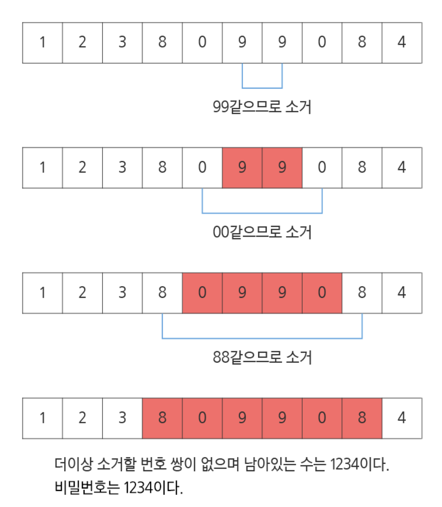

# [1234. [S/W 문제해결 기본] 10일차 - 비밀번호](https://swexpertacademy.com/main/code/problem/problemDetail.do?contestProbId=AV14_DEKAJcCFAYD&categoryId=AV14_DEKAJcCFAYD&categoryType=CODE&problemTitle=S%2FW+%EB%AC%B8%EC%A0%9C%ED%95%B4%EA%B2%B0+%EA%B8%B0%EB%B3%B8&orderBy=FIRST_REG_DATETIME&selectCodeLang=ALL&select-1=&pageSize=10&pageIndex=4)

## 문제 내용
평소에 잔머리가 발달하고 게으른 철수는 비밀번호를 기억하는 것이 너무 귀찮았습니다.

적어서 가지고 다니고 싶지만 누가 볼까봐 걱정입니다. 한가지 생각을 해냅니다.
 
0~9로 이루어진 번호 문자열에서 같은 번호로 붙어있는 쌍들을 소거하고 남은 번호를 비밀번호로 만드는 것입니다.

번호 쌍이 소거되고 소거된 번호 쌍의 좌우 번호가 같은 번호이면 또 소거 할 수 있습니다.

예를 들어 아래의 번호 열을 철수의 방법으로 소거하고 알아낸 비밀 번호입니다.


 
## [입력]

10개의 테스트 케이스가 10줄에 걸쳐, 한 줄에 테스트 케이스 하나씩 제공된다.

각 테스트 케이스는 우선 문자열이 포함하는 문자의 총 수가 주어지고, 공백을 둔 다음 번호 문자열이 공백 없이 제공된다.

문자열은 0~9로 구성되며 문자열의 길이 N은 10≤N≤100이다. 비밀번호의 길이는 문자열의 길이보다 작다.
 
## [출력]

#부호와 함께 테스트 케이스의 번호를 출력하고, 공백 문자 후 테스트 케이스에 대한 답(비밀번호)을 출력한다.

---

### 입력
```
10 1238099084  
16 4100112380990844
...
```

### 출력
```
#1 1234
#2 4123
...
```
