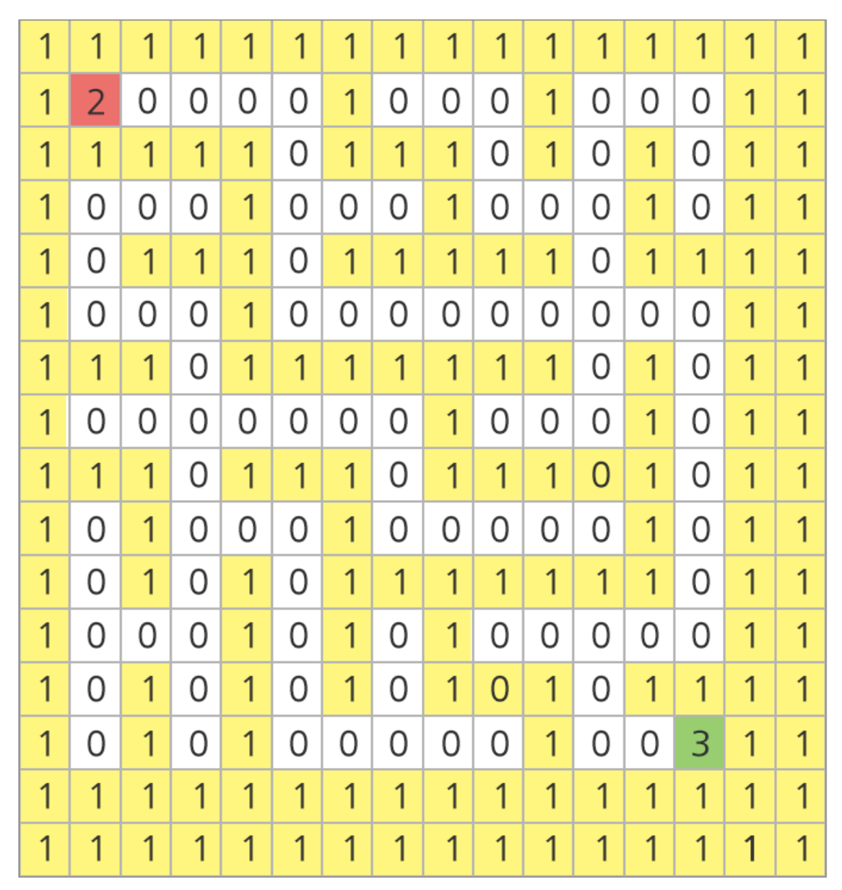
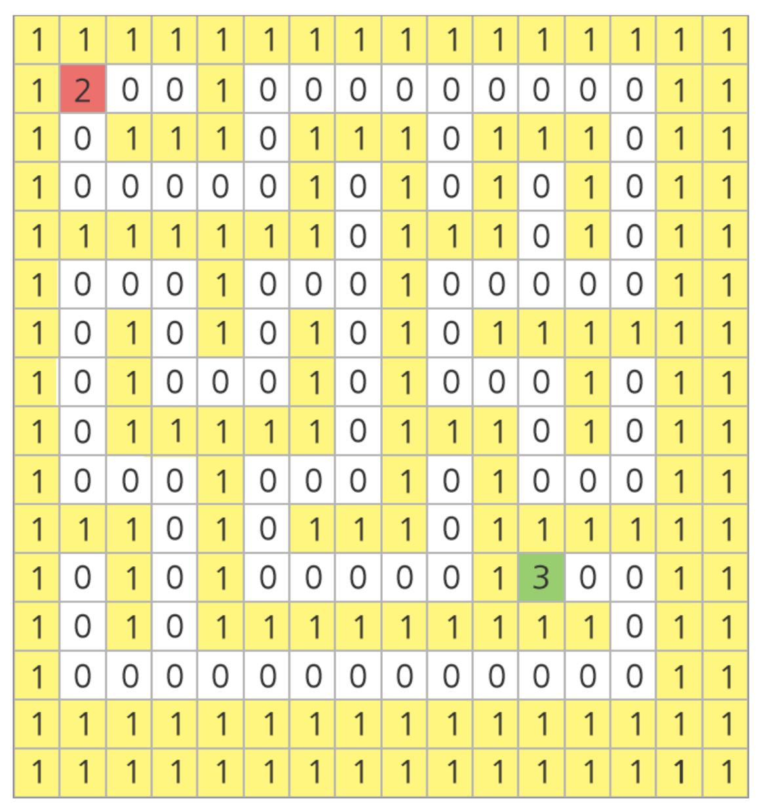

# 1227. [S/W 문제해결 기본] 7일차 - 미로2

[문제 링크](https://swexpertacademy.com/main/code/problem/problemDetail.do?contestProbId=AV14wL9KAGkCFAYD&categoryId=AV14wL9KAGkCFAYD&categoryType=CODE&problemTitle=S%2FW+%EB%AC%B8%EC%A0%9C%ED%95%B4%EA%B2%B0+%EA%B8%B0%EB%B3%B8&orderBy=FIRST_REG_DATETIME&selectCodeLang=ALL&select-1=&pageSize=10&pageIndex=4)

## 문제 내용
아래 그림과 같은 미로가 있다. 100*100 행렬의 형태로 만들어진 미로에서 흰색 바탕은 길, 노란색 바탕은 벽을 나타낸다.

가장 좌상단에 있는 칸을 (0, 0)의 기준으로 하여, 가로방향을 x 방향, 세로방향을 y 방향이라고 할 때, 미로의 시작점은 (1, 1)이고 도착점은 (13, 13)이다.

주어진 미로의 출발점으로부터 도착지점까지 갈 수 있는 길이 있는지 판단하는 프로그램을 작성하라.

아래의 예시에서는 도달 가능하다.
 



아래의 예시에서는 출발점이 (1, 1)이고, 도착점이 (11, 11)이며 도달이 불가능하다.
 

 

위의 예시는 공간상의 이유로 100x100이 아닌 16x16으로 주어졌음에 유의한다.

## 입력

각 테스트 케이스의 첫 번째 줄에는 테스트케이스의 번호가 주어지며, 바로 다음 줄에 테스트 케이스가 주어진다.

총 10개의 테스트 케이스가 주어진다.

테스트 케이스에서 1은 벽을 나타내며 0은 길, 2는 출발점, 3은 도착점을 나타낸다.

## 출력

#부호와 함께 테스트 케이스의 번호를 출력하고, 공백 문자 후 도달 가능 여부를 1 또는 0으로 표시한다 (1 - 가능함, 0 - 가능하지 않음).

**입력**
```
1
111111111111111111111111111111111111111111111111111111111111111111111111111111...
121000000010000000000000000000000000000000100010001000000000000010000010000000...
101011111011101110111111111111111111111110101011101011111110111010111010101110...
100010001010001000100000000010000000000010001010001000101000101010001010101000...
111110101010111111101111111011101110111111111010111110101011101010101110101111...
100000101010001000001000001000101010000010000010100010101000100010100000100010...
...
2
111111111111111111111111111111111111111111111111111111111111111111111111111111...
121000000010000000100010000000000010000010001000100000101000000000000010000000...
101110111011111010101010111111111011101010101010101110101011111011111010111110...
100010101000000010001010001000001000001010100010001010100000001000100010001000...
111010101111111111111010101011101111111010111111111010111011111110111111101011...
101000100000100000001010100010100000100010100000100010001010000000100000001010...
101111101110101011111010111110111110101110101110101011101010111110101111111010...
...
```
---

**출력**
```
#1 1
#2 1
...
```

---